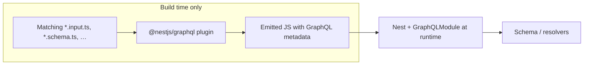

# Codebase map (AI / agent reference)

Granular structure of **nestjs-mongodb-graphql**: NestJS 11, GraphQL (Apollo, code-first), MongoDB (Mongoose), JWT auth, global guards, activity logging.

---

## Rules for new modules and APIs

When adding a **new Nest module**, **GraphQL resolver**, **REST controller**, or **Mongoose feature**:

1. **Read and follow this file** (`.agents/CODEBASE.md`) for layout, global guards, env, tooling, and pitfalls.
2. **Mirror existing modules** as the primary template — especially **`user/`** (resolver + service + `forFeature` schema + DTOs) and **`auth/`** (resolver + service + strategy + module wiring). Match naming (`*.resolver.ts`, `*.service.ts`, `*.module.ts`), decorator usage (`@Public()`, `@Roles()` where appropriate), and how `AppModule` imports and orders providers.
3. After changes, align with repo tooling: **`biome check`**, **`nest build`**, and the sections **Tooling (agents: do not break)** and **Pitfalls for automated edits** later in this file.
4. **Name things for people:** use human-readable variables and identifiers — see [Naming: human-readable variables and identifiers](#naming-human-readable-variables-and-identifiers).

Do not invent a parallel structure (e.g. a different folder layout or auth pattern) unless this document is updated to match.

---

## Entry points

| Path | Role |
|------|------|
| `src/main.ts` | HTTP bootstrap: `ValidationPipe`, CORS, `compression`, `helmet`, listens on `PORT` (default 3000). GraphQL at `/graphql`. |
| `src/app.module.ts` | Root module: `ConfigModule`, `RequestContextModule`, `MongooseModule`, `GraphQLModule`, `ThrottlerModule`, feature modules, **global** guards + `TrimPipe`. |

---

## Source tree (`src/`)

```
src/
├── main.ts
├── app.module.ts
├── app.controller.ts          # GET / — hello (marked @Public)
├── app.service.ts
├── config/
│   └── env.validation.ts      # validateEnv for ConfigModule; defines AppEnv shape
├── auth/
│   ├── auth.module.ts         # JwtModule + UserModule; AuthResolver, AuthService, JwtStrategy
│   ├── auth.service.ts        # login, signup, refreshToken; argon2; JWT sign/verify
│   ├── auth.resolver.ts       # @Public() mutations: login, signup, refreshToken
│   ├── dtos/
│   │   └── auth.input.ts      # LoginInput, SignupInput, LoginResponse, RefreshTokenInput
│   ├── interfaces/
│   │   └── jwt.interface.ts  # JwtPayload { sub: string, email }, Tokens
│   └── strategies/
│       └── jwt.strategy.ts    # passport-jwt validate → UserService.getUser by ObjectId
├── user/
│   ├── user.module.ts         # Mongoose forFeature User
│   ├── user.service.ts        # CRUD, paginate, search (escaped regex)
│   ├── user.resolver.ts       # createUser, getUser, getUsers, updateUser, softDeleteUser
│   ├── schema/
│   │   └── user.schema.ts     # User model + GraphQL @ObjectType (password @HideField)
│   └── dtos/
│       └── user.input.ts      # GetUserInput, PaginateUserInput, CreateUserInput, etc.
├── activity-logs/
│   ├── activity-logs.module.ts
│   ├── activity-logs.service.ts  # ActivityLog model + Connection.plugin(ActivityLogService.apply)
│   └── schemas/
│       └── activity-logs.schema.ts
├── common/
│   ├── decorators/
│   │   ├── public.decorator.ts
│   │   ├── optional-auth.decorator.ts
│   │   ├── roles.decorator.ts
│   │   └── current-user.decorator.ts
│   ├── guards/
│   │   ├── gql-auth.guard.ts
│   │   ├── graphq-throttler.guard.ts
│   │   └── roles.guard.ts
│   ├── pipes/
│   │   └── trim.pipe.ts
│   ├── validators/
│   │   └── is-not-blank.validator.ts
│   ├── objecttypes/
│   │   └── pagination.ts      # PaginatedType() factory for GraphQL
│   ├── interfaces/
│   │   └── mongoose.interface.ts
│   └── utils/
│       └── escape-regex.ts    # escapeRegexLiteral for user search $regex
└── types/
    └── mongoose-unique-validator.d.ts
```

---

## `test/`

| Path | Role |
|------|------|
| `test/app.e2e-spec.ts` | [Vitest](https://vitest.dev/) e2e: Supertest + `Test.createTestingModule` + `AppModule`. |
| `test/vitest.setup.ts` | `reflect-metadata` (loaded before any Nest module). |
| `vitest.config.ts` | Vitest: Node env, `pool: 'forks'`, optional v8 coverage. |

**`npm run test` / `bun run test`** runs **`nest build` then `vitest run`** so `src/metadata.ts` (GraphQL code-first field metadata) stays in sync for tests. After changing DTOs/schemas only, re-run a build before expecting e2e to pass. Use **`bunx vitest watch`** for faster loops when the app code is already built.

Unit tests: no `*.spec.ts` under `src/` at time of writing; `include` in `vitest.config.ts` is ready for `src/**/*.spec.ts`.

---

## Module dependencies (feature level)

```text
AppModule
├── ConfigModule (global, validate: env.validation)
├── RequestContextModule
├── MongooseModule.forRootAsync
│   └── connection plugins: mongoose-paginate-v2, mongoose-unique-validator, ActivityLogService.apply
├── GraphQLModule (code-first, autoSchemaFile, formatError)
├── ThrottlerModule
├── ActivityLogModule  → exports ActivityLogService
├── UserModule         → exports UserService
└── AuthModule
    ├── imports: JwtModule, UserModule
    └── providers: AuthResolver, AuthService, JwtStrategy
```

---

## Global cross-cutting (order matters)

1. **`TrimPipe`** (APP_PIPE) — trims string inputs.
2. **`GqlThrottlerGuard`** — rate limit; uses GraphQL context `req`/`res`.
3. **`GqlAuthGuard`** — JWT unless `@Public()` or optional-auth path.
4. **`RolesGuard`** — enforces `@Roles()` when set; passes if no roles metadata.

`ValidationPipe` is applied in `main.ts` (whitelist, transform).

---

## GraphQL surface (resolvers)

| Resolver | Public / auth | Main operations |
|----------|----------------|-----------------|
| `auth.resolver.ts` | `@Public()` | `login`, `signup`, `refreshToken` |
| `user.resolver.ts` | default: JWT required | `createUser`, `getUser` (nullable), `getUsers` (paginated), `updateUser`, `softDeleteUser` |

Schema generated in memory (`autoSchemaFile: true`); no separate `schema.gql` file in repo by default.

---

## Nest CLI: GraphQL compiler plugin

`nest-cli.json` registers **`@nestjs/graphql`** under `compilerOptions.plugins` (Nest CLI **GraphQL plugin**). It runs at **compile time** to improve code-first GraphQL metadata and typings (not a separate runtime package).

| Option | Value | Effect |
|--------|--------|--------|
| `name` | `@nestjs/graphql` | Enables the official Nest GraphQL TS/SWC plugin. |
| `typeFileNameSuffix` | `.schema.ts`, `.input.ts`, `.entity.ts`, `.dto.ts` | Limits plugin behavior to files whose names end with these suffixes (aligns DTO/schema naming in this repo). |
| `introspectComments` | `true` | Uses comments on fields/classes for GraphQL descriptions where the plugin supports it. |

### How the GraphQL plugin works

1. **When it runs**  
   Only during **compilation** (`nest build`, `nest start`, watch, or webpack dev with the Nest pipeline). It is a **compiler plugin** wired through the Nest CLI’s `compilerOptions.plugins` array, not code that executes inside your HTTP/GraphQL request path.

2. **What it does (mechanism)**  
   For each **matching source file** (see `typeFileNameSuffix`), the plugin runs a **TypeScript AST transform**: it inspects classes, properties, and TypeScript types, then **injects or supplements GraphQL-related metadata** (for example, helping code-first types map to fields so you write less manual `@Field()` / boilerplate than without the plugin). The emitted JavaScript (and decorator metadata) is what the normal **`@nestjs/graphql` runtime** then uses when `GraphQLModule` builds the schema.

3. **What it does not do**  
   - It is **not** a second GraphQL server and **not** a replacement for `GraphQLModule` in `app.module.ts`.  
   - It does **not** by itself write `schema.gql` to disk; this project still uses in-memory / `autoSchemaFile` behavior as configured in `app.module`.  
   - It does **not** run in production as a separate process; only the **build** step uses it.

4. **File filtering (`typeFileNameSuffix`)**  
   The plugin **skips** files that do not end with one of the listed suffixes. In this repo, DTOs like `user.input.ts` and schemas like `user.schema.ts` match; a file such as `foo.model.ts` would **not** get the transform unless you add a suffix to the list in `nest-cli.json`.

5. **Comments → descriptions (`introspectComments: true`)**  
   Where supported, JSDoc or block comments on classes/properties can flow into the **GraphQL field/type descriptions** in the generated schema, improving the Explorer/docs without duplicating text.

6. **Mental model**  
   `Source TS (DTOs) → [compiler + GraphQL plugin] → emitted JS + decorators → Nest boot → GraphQL schema from code-first definitions`.



Official overview: [NestJS GraphQL CLI plugin](https://docs.nestjs.com/graphql/cli-plugin).

**Agent note:** Changing `typeFileNameSuffix` affects which files get plugin transforms; keep new GraphQL DTOs/schemas on those suffixes or extend the list in `nest-cli.json`.

---

## Auth & data conventions

- **Passwords:** argon2 hash in `UserService` / `AuthService` verify.
- **JWT:** access + refresh; payload `JwtPayload.sub` is **string** (JSON); DB lookups use `Types.ObjectId.isValid` + `new Types.ObjectId(sub)` where needed.
- **User model:** Mongoose schema colocated with GraphQL types; enum registration via `registerEnumType`.
- **getUser query:** returns **`null`** if not found (nullable field), does not throw.

---

## Naming: human-readable variables and identifiers

Code in this repo should read clearly to humans reviewing and maintaining it, not just to the compiler.

- **Prefer full, descriptive names** over cryptic abbreviations. Favor `sessionId`, `accessToken`, `isSuperAdmin` over `sid`, `at`, `sup` unless the project already standardizes a short form (e.g. `id` in GraphQL DTOs where context is obvious).
- **Booleans** should sound like questions or state: `isEnabled`, `hasPassword`, `canEdit`, not `flag` or `ok`.
- **Functions and methods** are verbs or verb phrases: `buildSessionMetadata`, `resolveUser`, not `data` or `process`.
- **Single-letter names** (`i`, `e`, `x`) are only for very small scopes (e.g. a simple index in a one-line callback). Even then, prefer a word when it clarifies meaning (`err` in a catch is acceptable; `user` is better than `u` in a resolver).
- **Match existing modules** for the same concept (`userId` vs `userID`): pick the dominant spelling in the file you are editing, not a new variant.

When in doubt, mirror **User** and **auth** services and DTOs in this repository.

---

## Activity logging

- `ActivityLogService.apply` registered on **Mongoose connection** in `app.module` `onConnectionCreate`.
- Hooks on document save/update/delete; reads request from `nestjs-request-context` for user id; sanitizes passwords / skips refresh token payloads.

---

## Environment (`src/config/env.validation.ts`)

| Variable | Notes |
|----------|--------|
| `NODE_ENV` | `development` \| `test` \| `production` (default dev) |
| `PORT` | number, default 3000 |
| `MONGODB_URI` | required |
| `ACCESS_TOKEN_SECRET` | required |
| `REFRESH_TOKEN_SECRET` | required |

---

## Tooling (agents: do not break)

| File | Purpose |
|------|---------|
| `biome.json` | Lint/format; **`style.useImportType` = off** (Nest DI needs value imports, not `import type` for injected classes). `unsafeParameterDecoratorsEnabled: true`. |
| `package.json` → `lint-staged` | `biome check --write` with `--no-errors-on-unmatched` + `--files-ignore-unknown=true` on staged `*.{ts,js,json,md}`. |
| `.husky/pre-commit` | `lint-staged` then `bun run build` (or equivalent from package). |
| `tsconfig.json` | `strict`, `emitDecoratorMetadata`, `experimentalDecorators`, `noUncheckedIndexedAccess`, `exactOptionalPropertyTypes`, `skipLibCheck`. |
| `nest-cli.json` | **`@nestjs/graphql` compiler plugin** — see [Nest CLI: GraphQL compiler plugin](#nest-cli-graphql-compiler-plugin). |
| `vitest.config.ts` | [Vitest](https://vitest.dev/); tests run after `nest build` in `package.json` for metadata/DTO sync. |
| `webpack-hmr.config.js` | Used by `bun run dev` / HMR. |

---

## Out-of-tree / generated

- `dist/` — build output (`nest build` / `start:prod`).
- `documentation/` — Compodoc output (if generated); not required for app runtime.
- `node_modules/` — dependencies.

---

## Pitfalls for automated edits

1. **Do not** use `import type` for classes injected in Nest constructors (`UserService`, `ConfigService`, `JwtService`, `Reflector`); it breaks `emitDecoratorMetadata` and DI.
2. **Throttler + GraphQL** must use `GqlThrottlerGuard`-style request extraction, not only HTTP.
3. **Mongoose plugins** on connection apply to all schemas; activity log plugin must stay load-order aware.
4. **Search:** user list search uses `escapeRegexLiteral` in `user.service` — do not pass raw user `search` into `$regex` unescaped.
5. After structural changes, run `biome check` and `nest build` to align with pre-commit.

---

## Quick “where to change what”

| Task | Start here |
|------|------------|
| New GraphQL field / resolver | Feature module `*.resolver.ts` + service + DTO/schema |
| New REST route | `*.controller.ts` in a module; remember `@Public()` if unauthenticated |
| Auth rules for a resolver | `GqlAuthGuard` + `@Public()` / `@Roles()` on handler or class |
| DB model | Mongoose `*.schema.ts` + `forFeature` in module; GraphQL on same or separate DTOs |
| Env var | `env.validation.ts` + `ConfigService.getOrThrow` at use site |
| Rate limits | `ThrottlerModule` in `app.module` + `GqlThrottlerGuard` |
| Error shape to clients | `formatError` in `app.module` GraphQL config |

---

*Regenerate or extend this file when major folders or global behavior change.*
